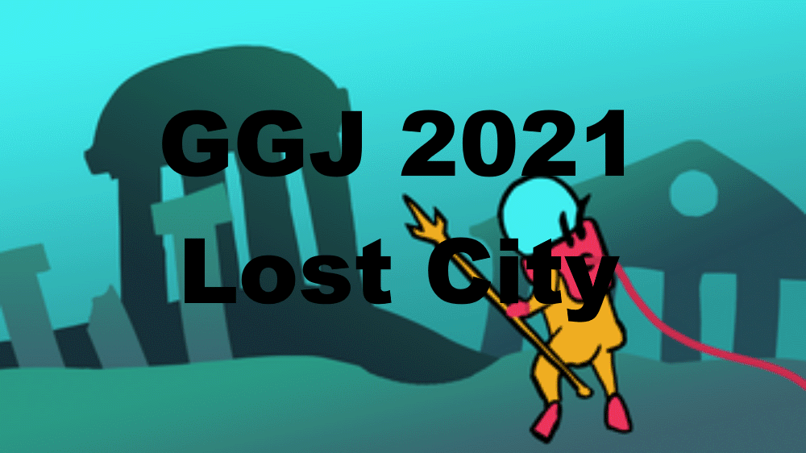
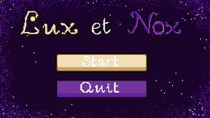
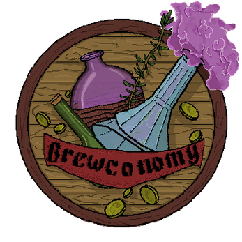

<h1>Freek Pluim</h1>

I am a student at Saxion Hogeschool in Enschede in The Netherlands, studying to become a video game programmer at Creative Media and Game Technology - CMGT. 

___

### Languages and Engines

 

#

### Previous Projects
#### Game Jams

___

#### School Projects

___

#### Personal Projects

<!--
**FreekPluim/FreekPluim** is a ✨ _special_ ✨ repository because its `README.md` (this file) appears on your GitHub profile.

Here are some ideas to get you started:

- 🔭 I’m currently working on ...
- 🌱 I’m currently learning ...
- 👯 I’m looking to collaborate on ...
- 🤔 I’m looking for help with ...
- 💬 Ask me about ...
- 📫 How to reach me: ...
- 😄 Pronouns: ...
- ⚡ Fun fact: ...
-->
